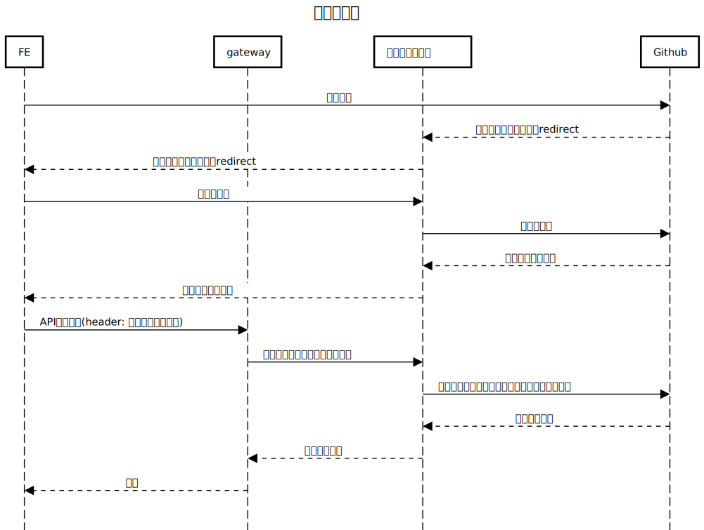

# microservice-sample
このリポジトリはSpringCloudのコンポーネントで構成されるマイクロサービスのサンプルです。

## コンポーネント

### Eureka
- サービスディスカバリ
- サービスレジストリとクライアントから構成されている
  - サービスレジストリ
    - マイクロサービスを管理する
  - クライアント
    - サービスレジストリに自身の情報を登録する
    - リクエスト送信時にサービスレジストリからリストを取得してサービスを特定できる(サービス間通信、ロードバランシングの実現)

### Spring Cloud OpenFeign
- RESTful API を使用するためのサービスで宣言的RESTクライアント
- Spring MVCと同じアノテーションが利用できる(`@RequestMapping`, `@GetMapping`)

### Spring Cloud Load Balancer
- 負荷分散

### Resilience4j
- サーキットブレーカー
- サーキットブレーカーには以下の3つの状態がある
  - CLOSED
    - 通常の状態
  - OPEN
    - サーキットブレーカーが起動して、通信が行われない状態
  - HALF_OPEN
    - OPENからCLOSEDに状態が戻る途中段階で、リクエストの状態によってCLOSEDに戻る

### Spring CLoud Gateway
- API Gateway
- ルーティング時に負荷分散できる
- パス、ヘッダー、HTTPメソッドなどでルーティングを制御可能
- ルーティングのweightの設定も可能

### Spring Cloud Config
- 設定ファイルをGitリポジトリなどに外出しして、configサーバーで一括管理する仕組み
- configのクライアントは`/actuator/refresh`にPOSTアクセスをするとconfigサーバーの設定値を読み込み直すため、設定ファイルを書き換える度にサービスを再起動する必要がなくなる
- `@ConfigurationProperties`
  - refreshで設定値がリロードされる
- `@Value`
  - refreshをしても設定値はリロードされない
  - クラスに`@RefreshScope`アノテーションを付与するとrefresh時に設定値がリロードされる

## システム構成

- Eureka Server
  - サービスディスカバリー
- authentication-service
  - Github OAuth を使った認証・認可をおこなう
  - gateway, client-1 ~ 4へのアクセス時にSpring Securityでアクセストークンを認証する
- gateway
  - パスによって`client-1`, `client-3`にルーティングを振り分け
- client-1
  - OpenFeign経由で`client-2`のメソッドを呼び出す
  - `client-2`呼び出し処理でサーキットブレーカーを実装
- client-2
  - アクセス元である`client-1`のport番号と自身のport番号を表示するメソッドを実装
- client-3
  - OpenFeign経由で`client-4`のメソッドを呼び出す
  - `client-4`呼び出し処理でサーキットブレーカーを実装
- client-4
  - アクセス元である`client-3`のport番号と自身のport番号を表示するメソッドを実装
- config-server
  - 設定ファイルを管理するconfigサーバー
- [config-repo](https://github.com/masakiii03/config-repo)(別リポジトリ)
  - 設定ファイルの一元管理
- フロントエンド
  - [microservice-frontend-sample](https://github.com/masakiii03/microservice-frontend-sample)(別リポジトリ)

## 認可コードフロー

## アクセス方法
### 通常系
- http://localhost:8080/sample/0
- http://localhost:8080/sample/0

### 異常系(サーキットブレーカーのタイムアウト発生)
- http://localhost:8080/sample/6
- http://localhost:8080/sample/6

### config設定の確認
- http://localhost:8888/{サービス名}/default

### config設定のrefresh
- http://localhost:{対象サービスのポート番号}/actuator/refresh (POST)

### config設定のrefreshの動作確認
- http://localhost:8080/value