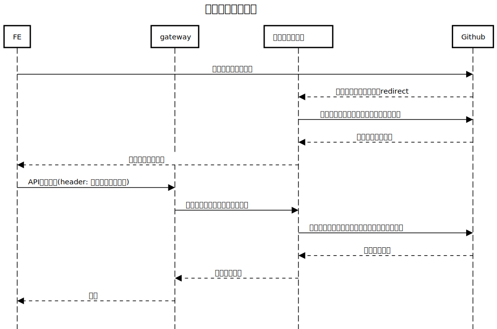

# microservice-sample
このリポジトリはSpringCloudのコンポーネントで構成されるマイクロサービスのサンプルです。

[microservice-frontend-sample](https://github.com/masakiii03/microservice-frontend-sample)(別リポジトリ)から呼び出すことを前提としています。

security面はGithub Oauth を利用した認可コードフローで認可を行っています。そのため、事前にGithub OAuthの作成も必要です。

## コンポーネント

### Eureka
- サービスディスカバリ
- サービスレジストリとクライアントから構成されている
  - サービスレジストリ
    - マイクロサービスを管理する
  - クライアント
    - サービスレジストリに自身の情報を登録する
    - リクエスト送信時にサービスレジストリからリストを取得してサービスを特定できる(サービス間通信、ロードバランシングの実現)

### Spring Cloud OpenFeign
- RESTful API を使用するためのサービスで宣言的RESTクライアント
- サービスディスカバリに登録されているサービス名を指定することで、サービス間呼出しが実現可能
- Spring MVCと同じアノテーションが利用できる(`@RequestMapping`, `@GetMapping`)

### Spring Cloud Load Balancer
- 負荷分散

### Resilience4j
- サーキットブレーカー
- サーキットブレーカーには以下の3つの状態がある
  - CLOSED
    - 通常の状態
  - OPEN
    - サーキットブレーカーが起動して、通信が行われない状態
  - HALF_OPEN
    - OPENからCLOSEDに状態が戻る途中段階で、リクエストの状態によってCLOSEDに戻る

### Spring CLoud Gateway
- API Gateway
- ルーティング時に負荷分散できる
- パス、ヘッダー、HTTPメソッドなどでルーティングを制御可能
- ルーティングのweightの設定も可能

### Spring Cloud Config
- 設定ファイルをGitリポジトリなどに外出しして、configサーバーで一括管理する仕組み
- configのクライアントは`/actuator/refresh`にPOSTアクセスをするとconfigサーバーの設定値を読み込み直すため、設定ファイルを書き換える度にサービスを再起動する必要がなくなる
- `@ConfigurationProperties`
  - refreshで設定値がリロードされる
- `@Value`
  - refreshをしても設定値はリロードされない
  - クラスに`@RefreshScope`アノテーションを付与するとrefresh時に設定値がリロードされる

### Spring Cloud Bus × RabbitMQ
各サービスのプロパティを一括refreshする仕組み
- Spring Cloud Bus
  - メッセージングサービス(AMQP)を利用してアプリ内に情報を配信できる
- RabbitMQ
  - メッセージキューを利用してアプリ間の非同期通信をおこなう仕組み

### Spring Security
- Spring ベースのアプリケーションを保護する標準フレームワーク
- 認証認可、アクセス制御が可能

### Micrometer × Zipkin
- 分散トレーシング
- 一つのトランザクションで複数マイクロサービスを跨ぐ場合に、サービスごとのパフォーマンスの確認やボトルネックを発見できる

- Micrometer
  - アプリのメトリクス収集ライブラリ
  - レスポンス時間、エラー、リクエスト数などを収集する
- Zipkin
  - 分散トレーシングシステムの一つ
  - 実装(コーディング)は不要で、設定追加のみでトレーシングをおこなえる
  - マイクロサービス間のリクエストフローを視覚化してそれぞれのサービスでの処理時間を把握できる
  - 以下で構成されている
    - トレーシングをおこなうトレーサー
    - トレース結果を確認するZipkinサーバー
  - 本来、トレースデータをDBに保存する必要があるが、テスト用にメモリ上にトレースデータを保存できる

必要な依存関係
- io.zipkin.reporter2:zipkin-reporter-brave
  - リクエストが発生した際にトレースや処理時間を収集する
- io.micrometer:micrometer-tracing-bridge-brave
  - `micrometer-tracing-bridge-brave`で収集した情報をZipkinに送信する
- io.github.openfeign:feign-micrometer
  - `MicrometerCapability`のBean作成に必要
  - `MicrometerCapability`のBeanはOpenFeignでのリクエストをMicrometerでモニタリングするために必要。
  このBeanがないとSpanIdごとに新しくTraceIdが生成されてしまう

## システム構成

- Eureka Server
  - サービスディスカバリー
- authentication-service
  - Github OAuth を使った認証・認可をおこなう
  - gateway, client-1 ~ 4へのアクセス時にSpring Securityでアクセストークンを認証する
- gateway
  - パスによって`client-1`, `client-3`にルーティングを振り分け
- client-1
  - OpenFeign経由で`client-2`のメソッドを呼び出す
  - `client-2`呼び出し処理でサーキットブレーカーを実装
- client-2
  - アクセス元である`client-1`のport番号と自身のport番号を表示するメソッドを実装
- client-3
  - OpenFeign経由で`client-4`のメソッドを呼び出す
  - `client-4`呼び出し処理でサーキットブレーカーを実装
- client-4
  - アクセス元である`client-3`のport番号と自身のport番号を表示するメソッドを実装
- config-server
  - 設定ファイルを管理するconfigサーバー
- [config-repo](https://github.com/masakiii03/config-repo)(別リポジトリ)
  - 設定ファイルの一元管理
- フロントエンド
  - [microservice-frontend-sample](https://github.com/masakiii03/microservice-frontend-sample)(別リポジトリ)

## 認可コードフロー

## 利用方法
### 起動
- Github OAuth を作成して、`client_id`と`client_secret`を取得
- 取得したGithub OAuth の情報から`microservice-sample/authentication-service/src/main/resources/application.yml`, `microservice-frontend-sample/src/Login.jsx`ファイルの環境変数を指定
- サービス起動(`config-server` → `eureka-server` → その他サービスの順)
  - Eurekaサーバーとclient-1 ~ 4は各`application.yml`のポートを変えて起動すればサービスの冗長化が可能
- 分散トレーシングを確認する場合
  - 以下コマンドを使ってdockerでZipkinを起動
    - `docker run -p 9411:9411 openzipkin/zipkin:latest`
- プロパティを一括refreshする場合
  - 以下コマンドを使ってdockerでRabbitMQを起動
    - `docker run -d --hostname my-rabbit --name some-rabbit -p 15672:15672 -p 5672:5672 rabbitmq:3-management`
- フロントエンド起動
  - [microservice-frontend-sample](https://github.com/masakiii03/microservice-frontend-sample)

### サービスディスカバリ
以下アクセスで確認
- http://localhost:8761
- http://localhost:8762

### config-server
- config設定の確認
  - http://localhost:8888/{サービス名}/default
- config設定のrefresh
  - http://localhost:{対象サービスのポート番号}/actuator/refresh (POST)

### プロパティの一括refresh
- http://localhost:8080/actuator/busrefresh (POST)

### Zipkin
- http://localhost:9411